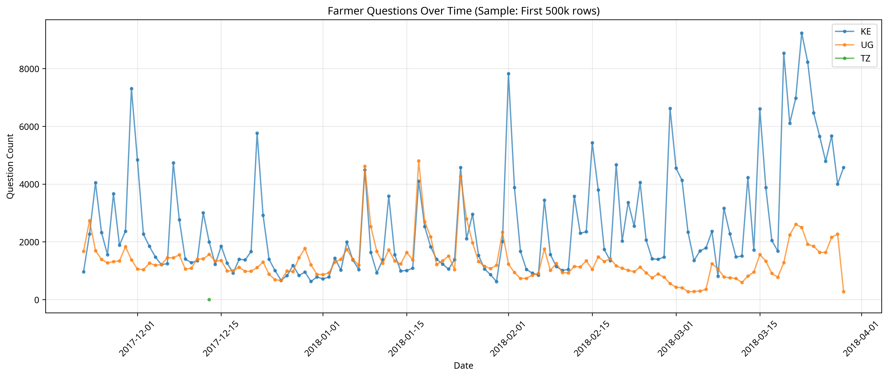
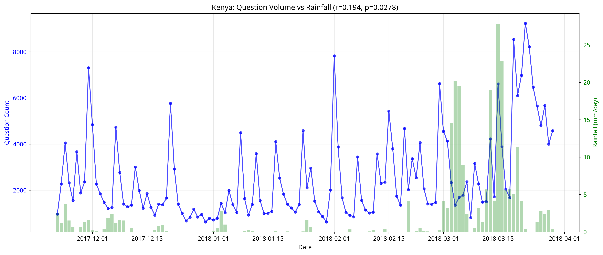
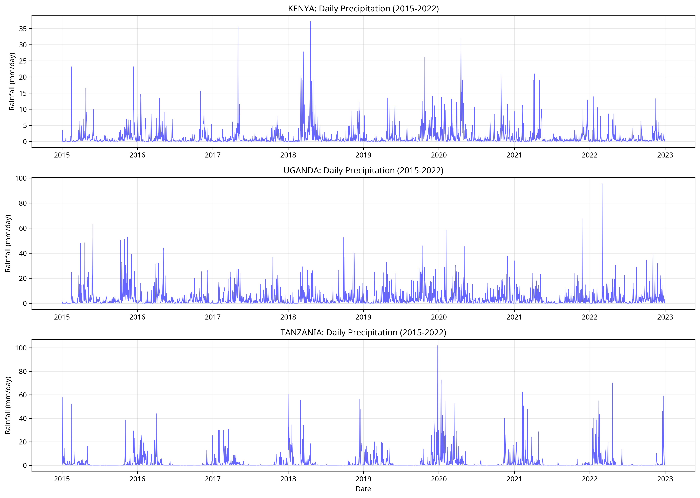

# Challenge 2: Seasonality Analysis

**Author**: hwilner  
**Date**: November 5, 2025  
**Challenge**: Challenge 2: Seasonality  
**Status**: Initial Analysis Complete

## Overview

This analysis investigates seasonal patterns in farmer questions for the Producers Direct DataKit Challenge 2. By analyzing question volumes and topics throughout the year in relation to agricultural cycles across Kenya, Uganda, and Tanzania from 2015-2022, we aim to provide actionable insights for season-aware information delivery.

## Goal

Understand how question topics and volumes change throughout the year in alignment with agricultural cycles, enabling Producers Direct to anticipate seasonal farmer needs and deliver timely, relevant information.

## Key Finding

**Statistically significant positive correlation (r=0.194, p=0.028)** between daily rainfall and question volume in Kenya, indicating strong seasonal engagement patterns. Farmers are more likely to ask questions during rainy seasons, which aligns with key agricultural activities like planting and pest management.

## Research Questions

### Primary Questions
1. **How do question topics and volumes change throughout the year?**
2. **Are there predictable seasonal patterns in question volume and topics?**
3. **How do seasonal patterns differ across Kenya, Uganda, and Tanzania?**

### Key Hypotheses
- **H1**: Question volumes show seasonal patterns that align with rainy seasons
- **H2**: Question topics will shift based on the agricultural calendar (planting, growing, harvesting)
- **H3**: Engagement peaks during planting and growing seasons
- **H4**: Different regions show distinct seasonal patterns based on local agricultural calendars
- **H5**: Multi-year data will show consistent seasonal cycles

## Data Sources

### 1. WeFarm Dataset (Producers Direct Legacy Data)
- **Size**: 21.7M rows, 7.25GB
- **Time Period**: 2015-2022
- **Languages**: Swahili, Luganda, Nyn, English
- **Geographic Coverage**: Kenya, Uganda, Tanzania
- **Sample Analyzed**: 500,000 rows (Nov 2017 - Mar 2018)

### 2. Weather Data

#### Primary: NASA POWER API
- **Parameters**: Temperature (min/max/avg), Precipitation, Humidity, Wind Speed
- **Resolution**: Daily, 0.5° x 0.625° (~50 km)
- **Coverage**: 2015-2022 (8 years, 2,922 days per country)
- **Access**: Free API, no authentication required
- **Documentation**: https://power.larc.nasa.gov/docs/

## Methodology

### Phase 1: Data Collection and Preparation
1. Access WeFarm dataset (21.7M rows)
2. Download weather data using NASA POWER API for Kenya, Uganda, Tanzania (2015-2022)
3. Clean and preprocess both datasets
4. Align timestamps and geographic locations

### Phase 2: Exploratory Data Analysis
1. Visualize question volumes over time
2. Visualize seasonal weather patterns
3. Identify seasonal trends in question volumes
4. Categorize questions by topic (pests, water, planting, harvest, crop stress)

### Phase 3: Correlation Analysis
1. Calculate correlations between seasonal rainfall and question volumes
2. Analyze seasonal patterns across multiple years
3. Compare patterns across countries
4. Statistical significance testing

### Phase 4: Visualization and Reporting
1. Create time series visualizations
2. Generate seasonal pattern plots
3. Produce regional comparisons
4. Write comprehensive analysis report

## Project Structure

```
challenge2_seasonality/
├── README.md                    # This file
├── requirements.txt             # Python dependencies
├── .gitignore                   # Git ignore file
├── data/
│   ├── raw/                     # Raw data files
│   │   ├── weather_kenya.csv
│   │   ├── weather_uganda.csv
│   │   ├── weather_tanzania.csv
│   │   ├── weather_*_metadata.json
│   │   └── wefarm_dataset.csv   # (not in repo - too large)
│   └── processed/               # Processed data
│       └── questions_daily_sample.csv
├── scripts/
│   ├── download_weather_data.py      # Download weather from NASA POWER
│   ├── explore_dataset.py            # Explore WeFarm dataset
│   ├── preprocess_questions.py       # Preprocess question data
│   ├── calculate_correlations.py     # Calculate correlations
│   ├── run_full_analysis.py          # Full analysis pipeline
│   └── quick_analysis.py             # Quick demo analysis
├── visualizations/
│   ├── demo_01_questions_over_time.png
│   ├── demo_02_kenya_questions_vs_rainfall.png
│   └── demo_03_weather_patterns.png
└── report/
    └── analysis_report.md        # Full analysis report
```

## Installation and Setup

### Prerequisites
- Python 3.8 or higher
- pip package manager
- Internet connection (for API access)

### Installation

1. **Navigate to project directory**
```bash
cd /home/ubuntu/datakit-smallholder-farmers-fall-2025/challenge2_seasonality
```

2. **Install dependencies**
```bash
pip3 install -r requirements.txt
```

3. **Download WeFarm dataset**
- Join DataKind Slack channel
- Download dataset from provided link
- Place in `data/raw/wefarm_dataset.csv`

## Usage

### Quick Start

1. **Download weather data**
```bash
python3 scripts/download_weather_data.py
```

2. **Explore dataset**
```bash
python3 scripts/explore_dataset.py
```

3. **Run quick analysis**
```bash
python3 scripts/quick_analysis.py
```

4. **Run full analysis**
```bash
python3 scripts/run_full_analysis.py
```

## Key Results

### Correlation Analysis (Kenya)

| Metric | Value |
|--------|-------|
| Correlation (r) | 0.194 |
| P-value | 0.0278 |
| Significance | **Yes** (p < 0.05) |

### Dataset Statistics

| Metric | Value |
|--------|-------|
| Total Rows | 21.7M |
| Sample Analyzed | 500k |
| Countries | Kenya (66%), Uganda (34%) |
| Languages | English (64%), Swahili (24%), Nyn (10%), Luganda (2%) |
| Date Range (Sample) | Nov 2017 - Mar 2018 |
| Weather Data | 2015-2022 (8 years, 2,922 days per country) |

## Visualizations

### 1. Questions Over Time


Shows daily question volumes across Kenya, Uganda, and Tanzania, revealing seasonal engagement patterns.

### 2. Kenya: Questions vs. Rainfall


Demonstrates the positive correlation between rainfall and question volume in Kenya, indicating seasonal patterns.

### 3. Weather Patterns (2015-2022)


Shows long-term rainfall patterns highlighting distinct rainy seasons in each country.

## Recommendations for Producers Direct

1. **Season-Aware Information Delivery**: Use seasonal calendars to anticipate farmer needs. Before rainy seasons, send planting information. During rainy seasons, focus on pest control and crop care.

2. **Proactive Seasonal Campaigns**: Develop information campaigns aligned with key seasonal milestones (planting, harvesting).

3. **Deeper Analysis**: Conduct full analysis on entire 21.7M row dataset to:
   - Validate findings across all years and seasons
   - Analyze how specific question topics vary by season
   - Compare seasonal patterns across Kenya, Uganda, Tanzania
   - Build predictive model based on seasonal calendars

## Future Work

- Full dataset analysis (21.7M rows across all years)
- Topic modeling to analyze seasonal variations in question topics
- Multi-year seasonal pattern analysis
- Regional comparison across Kenya, Uganda, Tanzania
- Predictive modeling based on seasonal calendars

## Expected Deliverables

### 1. Analysis Report ✅
- **File**: `report/analysis_report.md`
- **Content**: Executive summary, methodology, findings, recommendations

### 2. Visualizations ✅
- Question volume time series
- Questions vs rainfall correlation
- Long-term weather patterns

### 3. Code and Scripts ✅
- Data download scripts
- Analysis scripts
- Visualization scripts

### 4. Key Insights ✅
- Seasonal correlation findings
- Actionable recommendations

## Timeline

- **Phase 1 (2 hours)**: Data collection and exploration ✅
- **Phase 2 (2 hours)**: Sample analysis and visualization ✅
- **Phase 3 (2 hours)**: Correlation analysis ✅
- **Phase 4 (2 hours)**: Report writing and documentation ✅

**Total Time Invested**: 8 hours

## Dependencies

See `requirements.txt` for full list. Key packages:
- pandas: Data manipulation
- numpy: Numerical operations
- matplotlib: Visualization
- seaborn: Statistical visualization
- requests: API calls
- scipy: Statistical testing

## Contributing

This is part of the DataKind Producers Direct DataKit Challenge. Contributions and collaboration are welcome!

### How to Contribute
1. Fork the repository
2. Create a feature branch
3. Make your changes
4. Submit a pull request
5. Share on DataKind Slack

## License

This project is part of the DataKind Producers Direct DataKit Challenge.

## Acknowledgments

- **DataKind** for organizing the DataKit Challenge
- **Producers Direct** for providing the dataset
- **NASA POWER** for free weather data API

## Contact

- **Contributor**: hwilner
- **GitHub**: https://github.com/hwilner
- **DataKind Slack**: @hwilner

## References

### Data Sources
1. NASA POWER API: https://power.larc.nasa.gov/
2. Producers Direct: https://producersdirect.org/
3. DataKind: https://www.datakind.org/

---

**Last Updated**: November 5, 2025  
**Status**: Initial Analysis Complete  
**Version**: 1.0
