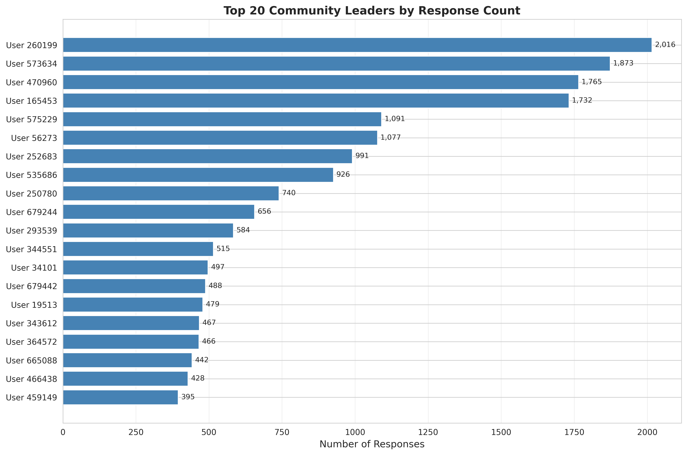
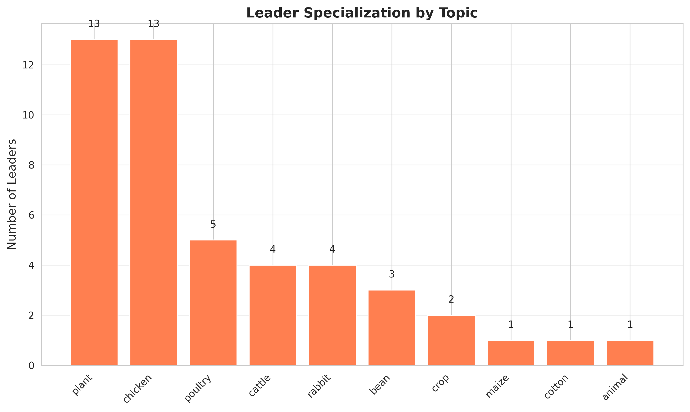
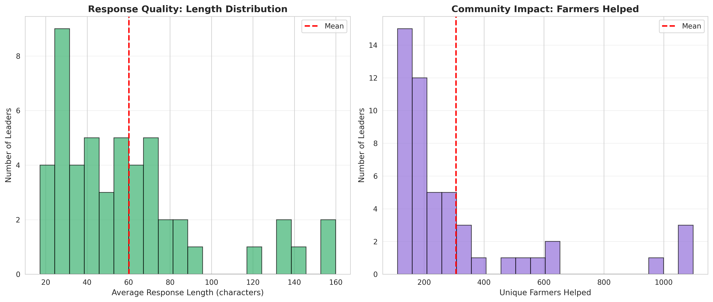

# Challenge 3: Identifying Community Leaders

**Author**: hwilner  
**Date**: November 6, 2025  
**Challenge**: Challenge 3: Identifying Community Leaders  
**Status**: Analysis Complete

## Overview

This project analyzes the WeFarm dataset to identify and characterize "community leaders"—users who consistently provide valuable support to others. By understanding their behavior and impact, we can provide recommendations to Producers Direct on how to empower these leaders and build trust in their digital advisory services.

## Key Findings

1.  **A Small Group of Leaders Provides Most of the Support**: The top 50 leaders (out of 87,078 responders) provided over 10% of all responses in the sample.
2.  **Leaders are Specialists and Generalists**: Leaders specialize in key topics like `plant` and `chicken`, but also answer questions across an average of 31 unique topics.
3.  **Geographic Focus**: 76% of leaders are from Kenya, indicating a more mature community in that region.
4.  **Potential Trust Issues**: A significant number of users (23,824) asked 5 or more questions, with some asking hundreds of questions on the same topic, which may indicate a lack of trust or information gaps.

## Project Structure

```
challenge3_community_leaders/
├── README.md                    # This file
├── requirements.txt             # Python dependencies
├── data/
│   ├── processed/
│   │   └── challenge3_leaderboard.csv
├── scripts/
│   └── challenge3_analysis.py
├── visualizations/
│   ├── challenge3_viz1_top_contributors.png
│   ├── challenge3_viz2_topic_specialization.png
│   └── challenge3_viz3_quality_metrics.png
└── report/
    ├── analysis_report.md
    └── challenge3_summary.txt
```

## Data Sources

-   **WeFarm Dataset**: 21.7M question-response pairs (500k sample analyzed)

## Installation

```bash
pip3 install -r requirements.txt
```

## Usage

To run the analysis:

```bash
python3 scripts/challenge3_analysis.py
```

This will:
1.  Load the WeFarm dataset.
2.  Identify the top 50 community leaders.
3.  Calculate leadership metrics (activity, quality, diversity).
4.  Analyze patterns in leader behavior.
5.  Analyze repeat questioning patterns.
6.  Save a leaderboard, summary statistics, and visualizations.

## Key Results

### Top 10 Community Leaders

| Rank | User ID | Total Responses |
| :--- | :------ | :-------------- |
| 1    | 260199  | 2,016           |
| 2    | 573634  | 1,873           |
| 3    | 470960  | 1,765           |
| 4    | 165453  | 1,732           |
| 5    | 575229  | 1,091           |
| 6    | 56273   | 1,077           |
| 7    | 252683  | 991             |
| 8    | 535686  | 926             |
| 9    | 250780  | 740             |
| 10   | 679244  | 656             |

### Visualizations

**Top 20 Community Leaders**


**Leader Topic Specialization**


**Response Quality and Impact**


## Recommendations

1.  **Recognize and Empower Leaders**: Create a formal recognition program for top contributors.
2.  **Improve Answer Quality**: Provide guidelines and incentives for providing detailed, high-quality answers.
3.  **Address Repeat Questioning**: Investigate why users are asking the same questions repeatedly and improve information discovery.

## Future Work

-   Analyze the full 21.7M row dataset.
-   Create network visualizations of the community.
-   Use NLP to analyze answer quality more deeply.

## Dependencies

-   pandas
-   numpy
-   matplotlib
-   seaborn


